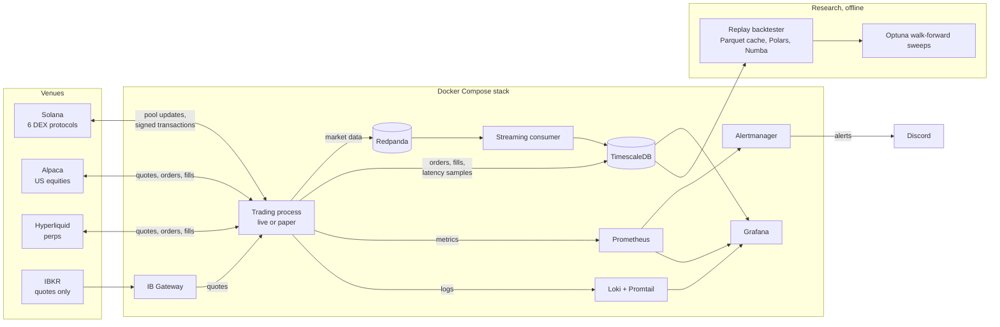
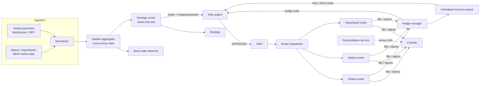
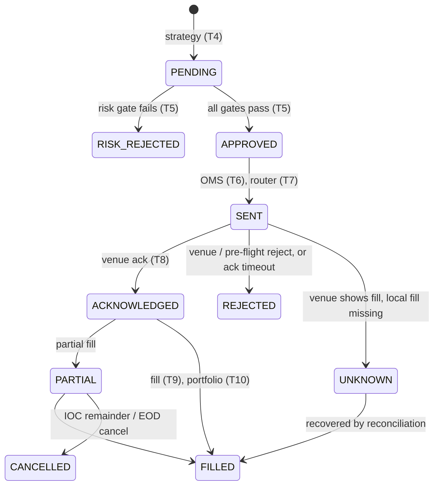
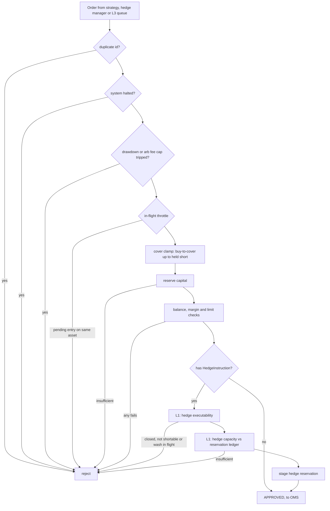
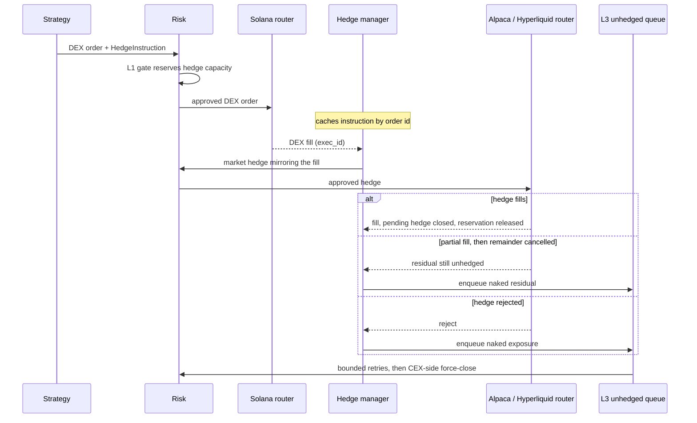
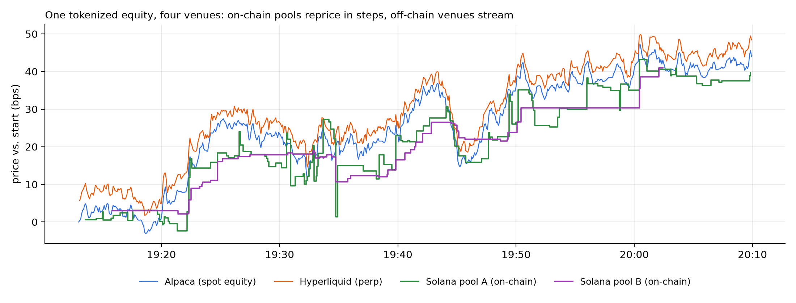

# trading-v1: architecture overview

I built this Python trading system solo and ran it live with my own capital; this repo is its architecture write-up. It runs a hedged tokenized-equity arbitrage: it trades six Solana DEX protocols directly on-chain and hedges on Alpaca and Hyperliquid, with the same strategy code running live and in deterministic replay. The implementation is private; questions are welcome at jannismenzler@gmail.com.

- **Scope:** 8 venues: six Solana DEX protocols with my own pool-state decoding, quoting and swap-instruction building, plus Alpaca (US equities) and Hyperliquid (perps).
- **Live/replay parity:** the production strategy, portfolio and hedge manager run unchanged in a deterministic backtester, and the remaining differences are audited and listed below.

## At a glance

| | |
|---|---|
| Language | Python 3.14 with asyncio, `mypy --strict` on all of `src/` |
| Venues | Raydium AMM v4, Raydium CLMM, Orca Whirlpool, Meteora DLMM, Byreal CLMM, Fusion CLMM; Alpaca; Hyperliquid |
| Venue clients | `solders`, `alpaca-py`, Hyperliquid SDK; IBKR as a data-only quote source |
| Hot-path numerics | Numba `@njit` quote kernels for CLMM, DLMM and constant-product pools |
| Storage | PostgreSQL/TimescaleDB; Redpanda (Kafka API) for market-data persistence off the hot path |
| Observability | Prometheus, Grafana, Loki/Promtail, Alertmanager to Discord |
| Research | Polars + Numba replay, Optuna walk-forward sweeps, Claude Code with a custom RAG system |
| Tooling | `uv`, `ruff`, `pytest`, Hypothesis, Docker Compose, GitHub Actions |

## Architecture

The system runs as one Docker Compose stack on a single machine. The trading process (live or paper) talks to the venues directly; everything else records, monitors or replays what it did.

### Inside the trading process

Components talk through an in-process pub/sub dispatcher with one `asyncio.Queue` per subscriber per topic, plus sync callbacks for replay.

Every order names its venue with a typed locator (pool, spot listing, perp listing or Jupiter route), and one asset registry maps aliases, mints and venue symbols. Direction is derived from input and output tokens rather than stored, which removes a class of sign bugs across legs. Swaps, equity orders and perp orders share one order model with FIX-style fields (`exec_id`, `cum_qty`, `leaves_qty`).

Orders, fills and balances use `Decimal`; strategy state and quote kernels use `float64`, with explicit, oracle-tested conversion points. In live mode each strategy evaluates only the latest event on the event loop, and a version check discards results that newer state has made stale. Replay evaluates every event.

## Venue adapters

Market data and execution are separate abstractions. An `Adapter` handles ingestion for the Solana pool feed, Alpaca, Hyperliquid, Jupiter and IBKR, plus replay sources in TimescaleDB or Parquet. IBKR is data-only: I added it because Alpaca's free IEX feed quoted far wider than the NBBO and produced phantom edges.

A `VenueRouter` handles execution (`submit`, `cancel`, order status) and exposes a reconciliation surface for venue orders, fills, positions and capital. Its contract fixes money semantics: `capital` never includes unrealized P&L, and CEX routers subtract short-sale liabilities. A third abstraction, `DEX`, holds per-protocol Solana logic: account parsing, pool-state hydration, quoting and swap-instruction building for each of the six protocols.

The Solana router builds, signs and poll-confirms transactions; the Alpaca and Hyperliquid routers wrap their SDKs and take fills over WebSocket. Each has a simulated counterpart for paper and replay. A new venue needs one adapter and one router, with strategy, risk and hedging code unchanged.

## Order lifecycle and telemetry

Each order carries a timestamp passport stamped at ten stages: ingestion, normalization, aggregation, strategy, risk, OMS, router send, venue ack, fill and portfolio. A T0 venue timestamp, estimated from the slot number on Solana, measures chain-to-system feed delay. The passport feeds per-segment latency histograms, an order-death histogram across hedge and retry chains, and per-fill tick-to-trade samples in TimescaleDB.

When a sent order passes its deadline, an ack watchdog queries the venue. A slow but live venue gets more time, a confirmed cancel becomes a cancel, and a venue fill with no local fill is marked `UNKNOWN` for reconciliation. If the fate is still unclear, the order is rejected with `oms_ack_timeout`, which downstream code treats as unknown rather than failed. A slow broker at the open can fill seconds after the deadline, and re-sending a hedge in that window once caused double execution. Timed-out recovery orders are now parked for a grace period, and a late fill closes them normally.

## Risk engine

Two engines share one contract: an async engine for paper and live, and a synchronous one for replay. They share the core limit checks but not all of the hedge-reservation logic.

Two named stages guard the hedge. L1 is the hedge-capacity gate at the end of the risk pipeline. L3 is the unhedged-inventory queue that retries failed hedges and force-closes them as a last resort; its orders pass through risk like any other. In live mode the checks run in this order and stop at the first failure:

The balance, margin and limit node covers balance, free margin, the margin breaker, position limit, order size, venue minimum notional and exposure. Manual operator orders can bypass an allowlist of soft gates and nothing else, and each bypass is logged.

Since the DEX fill is irreversible and the hedge follows it, L1 checks the hedge venue first. It computes what the hedge needs (buying power or cash), subtracts in-flight reservations on that venue, and rejects with the shortfall if the hedge doesn't fit. Live mode also requires an open venue calendar (perps excepted), shortability for short hedges, and no opposite-side order resting on the same instrument. The reservation ledger records per-order, per-venue amounts, releases them proportionally on partial fills, and is rebuilt from open orders on restart.

Circuit breakers cover session drawdown, bursts of transaction failures, a daily cap on transaction fees (base plus priority fees) spent on reverted arb attempts, and a Hyperliquid margin ladder that blocks, reduces, then flattens based on distance to the liquidation price. Halt and cancel-all are available from a terminal UI and an authenticated, audited control API.

## Two-leg execution, hedging and reconciliation

Strategies never build hedge orders. They attach a `HedgeInstruction` to the DEX order, and a hedge manager owns the rest.

Fills are deduplicated by `exec_id`. A partial hedge fill shrinks the pending residual instead of closing it, so a remainder the venue cancels can't become untracked exposure. A buy-to-cover is clamped to the short actually held, and a carry ledger separates flat round trips from abandoned hedges; only the latter are requeued.

The L3 queue retries residuals on a timer, then escalates to a slippage-bounded IOC force-close on the hedge venue. After a bounded number of failed force-closes, an entry goes `FAILED` and alerts instead of retrying forever. Entries persist across restarts.

Reconciliation is a single lock-serialized service. It resolves transaction timeouts from on-chain status, runs a three-phase startup sync (recover orders, reconcile with venues, diff wallets), and runs a periodic non-destructive venue sync with a cross-venue net-delta detector. The detector's optional self-healer sends only reduce-only orders through L3, only when the book agrees with broker truth, and ships in dry-run mode.

## Deterministic replay backtester

The backtester runs the production strategy, aggregator, portfolio and hedge manager in one synchronous loop. Data streams from TimescaleDB into a Parquet cache that later runs read through Polars, and a Numba pre-filter drops throttled events before the Python loop.

- An always-on collector records pool state, including surrounding tick or bin arrays, so fills are priced by the live quote kernels rather than a fixed slippage model.
- DEX orders are priced at the end of a confirmation window, and output below the minimum-output floor is rejected as an on-chain revert would be. Hedges fill at the taker side after a seeded lognormal delay fitted to observed latencies.
- Same commit, inputs and seed give identical metrics. Experiments start with an A/A control, and a guard flags runs where events flow but almost nothing fills.
- P&L is reported both analytically and realized, with DEX and hedge fills paired by lineage. The gap between the two is the hedging cost.

Parameter search uses Optuna over rolling walk-forward folds with a purge gap, scored only on the validation slice.

## Live vs replay parity

The strategy code is identical in both modes, but the components around it aren't. These are the differences that matter when reading a backtest:

| Area | Replay | Live |
|---|---|---|
| Strategy class and parameters | same code; defaults must be passed explicitly | same code |
| Event scheduling | every event, synchronous | latest-only conflation, stale results dropped |
| Risk engine | capital, position, size, exposure, in-flight, L1 hedge capacity | all of that plus halt, drawdown, margin, breakers and hedge executability |
| DEX fills | quote kernels over recorded pool state after a confirmation window | real transactions |
| Hedge fills | taker-side, seeded lognormal delay | broker fills |
| Hedge slippage estimate | frozen at a seed value | learned from broker fills and persisted |
| Restarts and warm state | always a cold start | warm state restored |
| L3 queue, reconciliation | not simulated | active |

A backtest here describes the strategy's decisions under recorded market states, not a forecast of live results. Where replay is more permissive, it overstates live performance; it will, for example, trade assets that the live shortability check would refuse.

## Observability

Everything runs as one Docker Compose stack: the trading process, TimescaleDB, Redpanda, Prometheus, Alertmanager, Loki, Grafana and a small ops app. Beyond health, positions and latencies, metrics expose strategy internals such as edge against threshold and signal drops by reason, so "why didn't it trade?" has a dashboard answer. An incident can be traced from a Grafana panel to the Loki lines for one order id, then to its passport stages and reconciliation record. Twenty-three alert rules route to Discord, covering feed staleness, fill latency, halts, position-book invariants and net-delta breaches.

## Performance work

Trade sizing is a bounded search over the pool's quote function, so quoting runs many times per evaluation. I rewrote the `Decimal` quote math as Numba `float64` kernels behind a thin `Decimal` adapter. A test oracle compares them with the old implementation and requires relative drift below 1e-9. A historical notebook run on real pool state recorded a median of 1,229 µs for the old trade-size search against 27 µs with Numba; raw samples and hardware details weren't kept, so that figure is indicative.

The pipeline benchmark measures what survives in the full path: the real strategy, synchronous risk and OMS, and the simulated router on one fixed synthetic opportunity, timed from strategy dispatch to router handoff.

- Two arms, JIT enabled and disabled, each pass in a fresh interpreter after warm-up, with a check that nothing compiled during measurement.
- ABBA ordering within each cycle cancels drift; five cycles gave 100,000 samples per arm.
- Both arms must emit identical orders, so the speedup can't come from a behaviour change. A run that overlapped a background test suite was discarded.

JIT won all ten paired comparisons. The p95 fell by 28–31%, the median by about 42%, and p99 by 17–30%. The benchmark excludes ingestion, venue acknowledgement and hedge completion, so it is not a live tick-to-trade figure. A Rust/PyO3 replay core was tried and abandoned because per-event Python callbacks cancelled the native gain.

## Strategy, at the level of mechanism

The main strategy is a hedged tokenized-equity arbitrage. Live trading is paused while I finish my bachelor's thesis.

On strategy the document stays generic: no thresholds, sizing rules, signal formulas or pool addresses. Results are private; happy to discuss fills and hedge slippage against the backtest.

Tokenized equities are Solana tokens that track US stocks and ETFs. Their pools are priced by on-chain liquidity providers and arbitrageurs, so the pool price can drift from the underlying's reference price, mostly when liquidity is thin or the equity market is moving.

When the gap covers pool fees, network costs and the hedge, the strategy swaps against the pool and offsets the position on a hedge venue (shares on Alpaca or a perpetual on Hyperliquid). Once both legs fill, what remains is roughly the spread minus costs. The engineering effort goes into confirming the hedge is possible before the on-chain leg, handling the cases where it fails anyway, and knowing the true position across venues.

*One tokenized equity across four venues, plotted from the system's recorded market data (prices shown relative to the start). On-chain pools reprice in discrete steps when someone trades against them; Alpaca and Hyperliquid stream continuously. The gaps between the lines are what the strategy trades.*

A second, unhedged strategy also traded live with real capital: atomic cross-pool arbitrage, where it buys a token in the cheapest pool and sells it in the richest within one two-hop transaction. A round trip that would net less than its costs fails the minimum-output check and reverts, costing only the transaction fee.

## Research loop

I ran strategy research as a repeatable loop, with Claude Code as the research tool: it proposed hypotheses, retrieved literature and notes through a RAG system I built, and ran backtests through the CLI's JSON output. I chose what to pursue, reviewed every verdict and made every deployment decision.

Each hypothesis is logged with a predicted verdict and confidence before any evidence, followed by a search for disconfirming evidence, a controlled backtest and an adversarial review. The ledger holds a little over a hundred entries, many refuted. The deployed strategy started as a data question in this loop and passed replay evaluation, a written review and paper trading before it reached real money.

## Testing, typing and CI

- Unit, integration (against real TimescaleDB), property, stress and specification tests; the end-to-end specification tests use the real risk engine and no mocks.
- Oracle and golden-master tests pin quote-kernel outputs and strategy orders, so numerical refactors can't shift results unnoticed.
- GitHub Actions runs `ruff`, `mypy --strict` and `pytest` on pull requests, and a deploy workflow rebuilds the stack on the server.

## Design decisions and tradeoffs

| Decision | Why | Cost |
|---|---|---|
| Python + Numba, not C++/Rust | fast iteration; Numba covers the numeric hot spots | Python overhead outside the kernels, though Solana slot time and broker round-trips bound latency anyway |
| In-process dispatcher; Kafka only for persistence | no network hop on the decision path | single process; scaling out would need a redesign |
| Gate the hedge before the irreversible leg | a DEX fill can't be undone | capacity-limited opportunities are rejected up front |
| Ack timeout means unknown, not failed | avoids re-sending a hedge that later fills | exposure stays unresolved for up to the grace period |
| Bounded retries, then alert | infinite retries hide problems and can compound them | needs an operator when escalation is exhausted |

## Known limitations

- Equity hedges go to Alpaca as DAY market orders even when IOC is requested. Hedge buys are sized in USD notional and covers can be fractional, and Alpaca accepts those only as DAY orders, so the router submits all equity market orders as DAY and logs the override. An unfilled remainder rests until the end-of-day cancel.
- L1 reserves hedge capacity at the quoted price, so a sharp move before the DEX fill can leave a small naked residual for L3.
- DEX state arrives at block cadence, which sets a latency floor no internal speedup changes. The system doesn't compete with co-located, sub-millisecond arbitrage.
- The online capital allocator is used in backtests but off by default in live.
- One operator, one host, and no failover beyond restart recovery.

### What I'd do differently

- Build one risk engine with a synchronous replay mode instead of two that share only some checks. The parity audit is the running cost of that split.
- Record every input replay needs from day one, including protocol volatility accumulators and per-venue hedge latencies. Reconstructing fee state from tick trajectories and using one global delay distribution work around data I didn't store.
- Derive positions from a single tagged fill stream from the start. The position book grew several write paths, and bugs where one path skipped cache maintenance led me to redesign it around one fill path.
